# OCR Application Flow Diagram - LLM Usage Analysis

## 🔄 Complete Application Flow with LLM Integration Points

```mermaid
graph TD
    A[📤 User Uploads Image] --> B[🖼️ Image Processing & Display]
    B --> C[🔍 Step 1: OCR Text Extraction]
    C --> C1[📋 Tesseract OCR Multiple Configs]
    C1 --> C2[✅ Best OCR Result Selected]
    
    C2 --> D[🎯 Step 2: Language Detection]
    D --> D1[🤖 Guesslang ML Model]
    D --> D2[📝 Pygments Lexer]
    D --> D3[🔍 Pattern Matching]
    D1 --> D4[📊 Combined Confidence Score]
    D2 --> D4
    D3 --> D4
    
    D4 --> E[🤖 Step 3: AI Model Selection]
    E --> E1{📋 Model Selection Method}
    E1 -->|Auto Selection| E2[🎯 Language-Specific Model]
    E1 -->|Dropdown Selection| E3[👤 User Chooses Model + Size Info]
    
    E2 --> F[🦙 OLLAMA LLM PROCESSING]
    E3 --> F
    
    F --> F1[🔄 LLM CALL 1: Detailed Overview]
    F --> F2[🔄 LLM CALL 2: Line-by-Line Comments]
    F --> F3[🔄 LLM CALL 3: Code Cleaning]
    
    F1 --> G1[📊 Section 1: Detailed Code Overview]
    F2 --> G2[💬 Section 2: Line-by-Line Comments]
    F3 --> G3[🔧 Section 3: Cleaned Code]
    C2 --> G4[📄 Section 4: Raw OCR Output]
    
    G1 --> H[💾 Save & Download Options]
    G2 --> H
    G3 --> H
    G4 --> H
    
    H --> I[✅ Complete Analysis Ready]
    
    style F fill:#ff9999,stroke:#333,stroke-width:4px
    style F1 fill:#ffcccc,stroke:#333,stroke-width:2px
    style F2 fill:#ffcccc,stroke:#333,stroke-width:2px
    style F3 fill:#ffcccc,stroke:#333,stroke-width:2px
```



## 🤖 LLM Usage Details

### 1. **LLM CALL 1: Detailed Code Overview** 
**File:** `advanced_ocr_system.py` → `create_detailed_overview()`
**Purpose:** Comprehensive technical analysis
**Input:** Raw OCR text + Language + Selected Model
**Output:** Detailed technical overview with 10 analysis sections

**Prompt Template:**
```
You are an expert {LANGUAGE} code analyst. Provide comprehensive analysis:
1. Purpose & Functionality
2. Technical Architecture  
3. Key Components
4. Data Flow
5. Dependencies
6. Complexity Assessment
7. Language-Specific Features
8. Code Quality
9. Potential Issues
10. Usage Context
```

**Ollama Configuration:**
- Temperature: 0.1 (focused)
- Max Tokens: 2500
- Context: 4096

---

### 2. **LLM CALL 2: Line-by-Line Comments**
**File:** `advanced_ocr_system.py` → `create_line_by_line_comments()`
**Purpose:** Educational line-by-line documentation
**Input:** Raw OCR text + Language + Selected Model
**Output:** Original code with detailed comments above each line

**Prompt Template:**
```
Add detailed educational comments above EVERY SINGLE LINE:
- Comment EVERY line individually
- Explain technical details
- Include parameter explanations
- Mention language-specific features
- Use proper comment syntax for {LANGUAGE}
```

**Ollama Configuration:**
- Temperature: 0.0 (very deterministic)
- Max Tokens: 4000
- Context: 4096

---

### 3. **LLM CALL 3: Code Cleaning**
**File:** `advanced_ocr_system.py` → `clean_code_only()`
**Purpose:** Fix OCR errors and clean code
**Input:** Raw OCR text + Language + Selected Model
**Output:** Clean, properly formatted code without comments

**Prompt Template:**
```
Clean and fix this OCR-extracted code:
1. Fix OCR errors (character misrecognition)
2. Correct syntax errors
3. Add proper indentation
4. Fix variable names and keywords
5. Follow best practices
6. NO comments - only clean code
```

**Ollama Configuration:**
- Temperature: 0.1 (focused)
- Max Tokens: 2000
- Context: 4096

## 🏗️ Model Architecture

### **Model Selection Logic:**
```python
language_models = {
    'sql': ['deepseek-coder-v2:16b', 'codellama:13b', 'qwen2.5-coder:7b'],
    'python': ['codellama:13b', 'deepseek-coder-v2:16b', 'qwen2.5-coder:7b'],
    'javascript': ['qwen2.5-coder:7b', 'codellama:13b', 'deepseek-coder-v2:16b'],
    'java': ['deepseek-coder-v2:16b', 'codellama:13b', 'wizardcoder:34b'],
    'csharp': ['deepseek-coder-v2:16b', 'wizardcoder:34b', 'codellama:13b'],
    'default': ['phi3:medium', 'codellama:7b', 'qwen2.5-coder:1.5b']
}
```

### **Available Models with Sizes:**
- **qwen2.5-coder:1.5b** (1.1GB) - Very Fast ⚡
- **phi3:mini** (2.3GB) - Very Fast ⚡
- **codellama:7b** (3.8GB) - Fast 🚀
- **qwen2.5-coder:7b** (4.2GB) - Fast 🚀
- **codellama:13b** (7.3GB) - Medium ⚖️
- **phi3:medium** (7.9GB) - Fast 🚀
- **deepseek-coder-v2:16b** (9.1GB) - Medium ⚖️
- **codellama:34b** (19GB) - Slow 🐌

## 📊 Processing Statistics

### **Total LLM Calls per Image:** 3
1. Overview Analysis (2500 tokens max)
2. Line-by-Line Comments (4000 tokens max)  
3. Code Cleaning (2000 tokens max)

### **Total Context Used:** ~8500 tokens per image
### **Processing Time:** Depends on model size and complexity
- Small models (1.5b-7b): 10-30 seconds total
- Medium models (13b-16b): 30-90 seconds total
- Large models (34b): 2-5 minutes total

## 🎛️ User Control Points

### **UI Control Over LLM Usage:**
1. **Model Selection Dropdown** - Choose specific model with size info
2. **Language Detection** - Affects model selection priority
3. **Auto-Save Toggle** - Controls whether results are automatically saved
4. **Expandable Sections** - User can focus on specific LLM outputs

### **No LLM Scenarios:**
- If no Ollama models available → Shows only raw OCR output
- If model selection fails → Falls back to available models
- If API calls fail → Shows error messages with fallback content

## 🔧 Technical Implementation

### **LLM Integration Points:**
- **Ollama API Client** - Direct API calls to local models
- **Model Availability Check** - `ollama.list()` at startup
- **Error Handling** - Graceful fallbacks if models unavailable
- **Streaming Options** - Disabled for better UI experience
- **GPU Acceleration** - Enabled via `num_gpu: -1`

### **Performance Optimizations:**
- **Temperature Control** - Lower for more focused outputs
- **Context Windows** - Optimized for code analysis
- **Thread Management** - Controlled CPU usage
- **Model Caching** - Models stay loaded between requests
